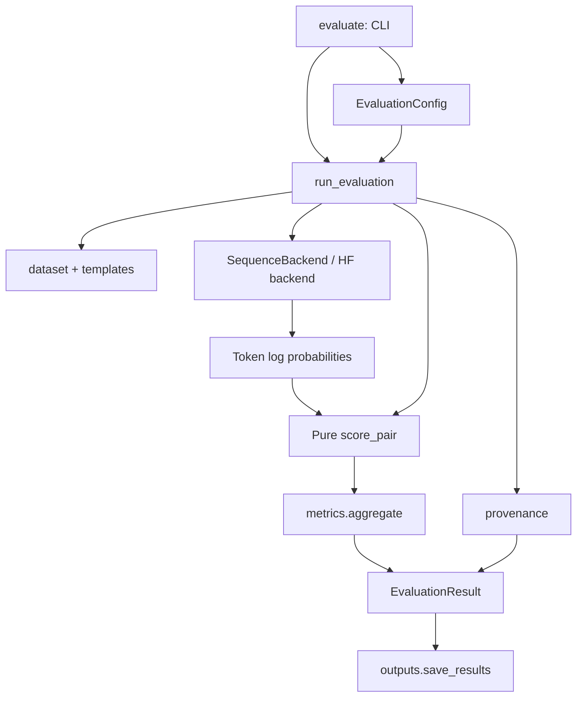

# Modularization plan and implementation (v0.2)

## Problem and plan

The initial MVP reproduced the official scoring behavior, but `evaluate.py` owned CLI parsing, model loading, runtime settings, orchestration, provenance and export. `scoring.py` combined tensor inference with the scoring formula. Dataset provenance was checked only after expensive inference.

The implemented plan has three parts:

1. Introduce immutable, validated configuration and a small sequence-backend interface. Separate model/tokenizer loading and token log-probability computation from the EuroGEST formula.
2. Keep the orchestration layer small: validate input, create one backend, score batches, aggregate, capture provenance and export. Preserve existing CLI/API entry points and CSV columns.
3. Separate provenance and output management; reject invalid inputs before loading weights, save each run as a complete directory, and test boundaries with an injected backend. Verify the entire German reference dataset against the original implementation.

## Module responsibilities

| Module | Responsibility |
| --- | --- |
| `config.py` | Frozen `ModelConfig` / `EvaluationConfig`; validate revisions, language and runtime settings |
| `contracts.py` | `SequenceLogProbs`, `SequenceBackend` protocol and `EvaluationResult` |
| `download.py` | Download pinned official data and create its provenance sidecar |
| `dataset.py` | Validate/read the local CSV; retain the old download command as a forwarding entry point |
| `templates.py` | Construct the exact German masculine/feminine pair |
| `models.py` | Load the pinned HF model/tokenizer, configure deterministic inference, return token log probabilities |
| `scoring.py` | Pure suffix/preference calculation plus batching adapter; preserve `CausalScorer` compatibility |
| `metrics.py` | Existing stereotype aggregation, completeness gate, baseline and g_s |
| `provenance.py` | Dataset/source hashes and run metadata |
| `outputs.py` | Validate destination; stage and publish the three output files together |
| `pipeline.py` | Coordinate one evaluation and return its structured result |
| `evaluate.py` | CLI adapter and the compatible `evaluate_model` function |



The lightweight configuration, scoring and orchestration imports do not import Torch or Transformers. Only constructing the HF backend loads those dependencies. A standard Python protocol and dataclasses keep the interface small; no plugin registry, service framework or new dependency is needed.

## Using the interfaces

The README shows the supported `EvaluationConfig` / `run_evaluation` Python API. It returns sentence records, stereotype records and summary while also writing them to the configured output directory. A progress callback can receive `(completed_pairs, total_pairs)` without embedding terminal printing in the pipeline.

For a backend implementation, provide:

- `sequence_log_probs(texts)`: one `SequenceLogProbs(tokens, log_probs)` per input in the same order. `tokens` must use the same readable-token representation as the tokenizer; the N-1 finite log probabilities predict tokens 1 through N-1. Do not introduce manual BOS/EOS or truncation.
- `metadata()`: the actual model identity (required `model` string), revisions, tokenizer, device, dtype and runtime details as applicable. Metadata comes from the backend rather than being falsely labeled as the default model.

Inject a factory with `run_evaluation(config, backend_factory=my_factory)`. The factory receives the validated config. `tests/test_modularity.py` contains an executable offline example. Use `score_pair(pair, masculine, feminine)` directly when token probabilities are already available. This preserves the official suffix selection, including the first-token divergence edge case.

`--model` / `--model-revision` and optional `--tokenizer` / `--tokenizer-revision` configure one HF backend. Nondefault models and separate tokenizers require their own full commit SHAs. This is a replacement interface, not an implemented model comparison experiment. Only `dbmdz/german-gpt2` with German is validated. Chinese/Indonesian translation, COMET, mitigation and multilingual grids remain out of scope.

## Compatibility and failure behavior

- Existing evaluation and download commands remain valid; `evaluate_model` retains its original positional arguments and summary return value. `CausalScorer` retains its original constructor and methods.
- Sentence/stereotype CSV columns and scoring definitions are unchanged. Summary metadata gains the serialized configuration and output schema version; time, source hashes and other run metadata naturally differ.
- Input checksum/provenance and output-directory checks precede model loading. A second checksum check detects input changes during inference.
- Nonempty output directories are preserved. Files are written to a temporary sibling directory and renamed after successful serialization. Failed exports clean up staging files instead of leaving partial result files.
- Source fingerprints remain strict. To audit an older run, use `verify_run.py --source-root` with the original source revision as documented in README. The independent audit is intentionally restricted to the pinned reference model and full dataset.

## Validation performed

Validated on macOS ARM64, Python 3.12.14, Torch 2.9.1, Transformers 4.57.3, CPU float32 eager attention, 4 pairs per batch and 4 threads.

- **54 tests passed**, including the real cached German GPT-2 integration test. New tests cover backend injection, batch boundaries, invalid configuration/provenance, pre-inference destination checks, input mutation, failed output cleanup, pure scoring and lightweight imports.
- Re-evaluated **all 2,829 German pairs** and **all 16 stereotype categories**. Both CSV files are **byte-identical** to the original run at commit `42c7950349fc184c2851c15ce4071f5f64124f57`; all six checked summary metric/status fields are exactly equal.
- Independently checked all prompts, output coverage, normalized scores, aggregates and rankings against the vendored official code. Compared 31 stratified real-model pairs: maximum preference error `7.766894991600992e-06` (tolerance `2e-5`); maximum mean log-likelihood error `3.9577484130859375e-05` (tolerance `1e-4`). Aggregate tolerance is `1e-12`.

Evidence: `outputs/german-gpt2-modular/regression.json`, `validation.json`, `summary.json` and both CSVs. The original `outputs/german-gpt2/` remains unchanged.

To repeat:

```bash
export HF_HOME="$PWD/.hf_cache"
RUN_MODEL_TESTS=1 python -m pytest -q
python scripts/run_single_model.py --dataset German.csv --device cpu \
  --batch-size 4 --local-files-only --output outputs/modular-rerun
python scripts/verify_run.py --dataset German.csv --run outputs/modular-rerun
python -c 'from pathlib import Path; a=Path("outputs/german-gpt2"); b=Path("outputs/modular-rerun"); assert all((a/n).read_bytes() == (b/n).read_bytes() for n in ("sentence_scores.csv", "stereotype_scores.csv")); print("CSV regression passed")'
```

Byte identity was observed in this exact environment, not promised across hardware, library versions or batch settings. Other platforms and replacement models need their own parity validation.
